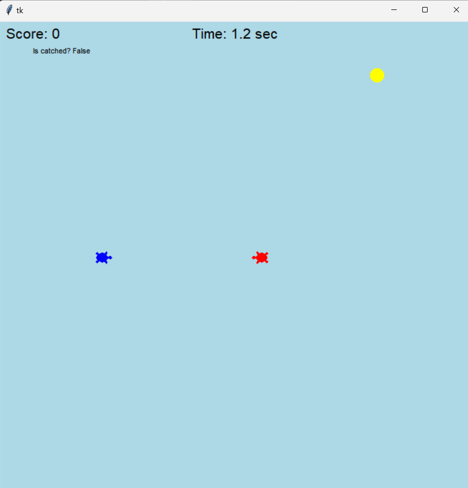
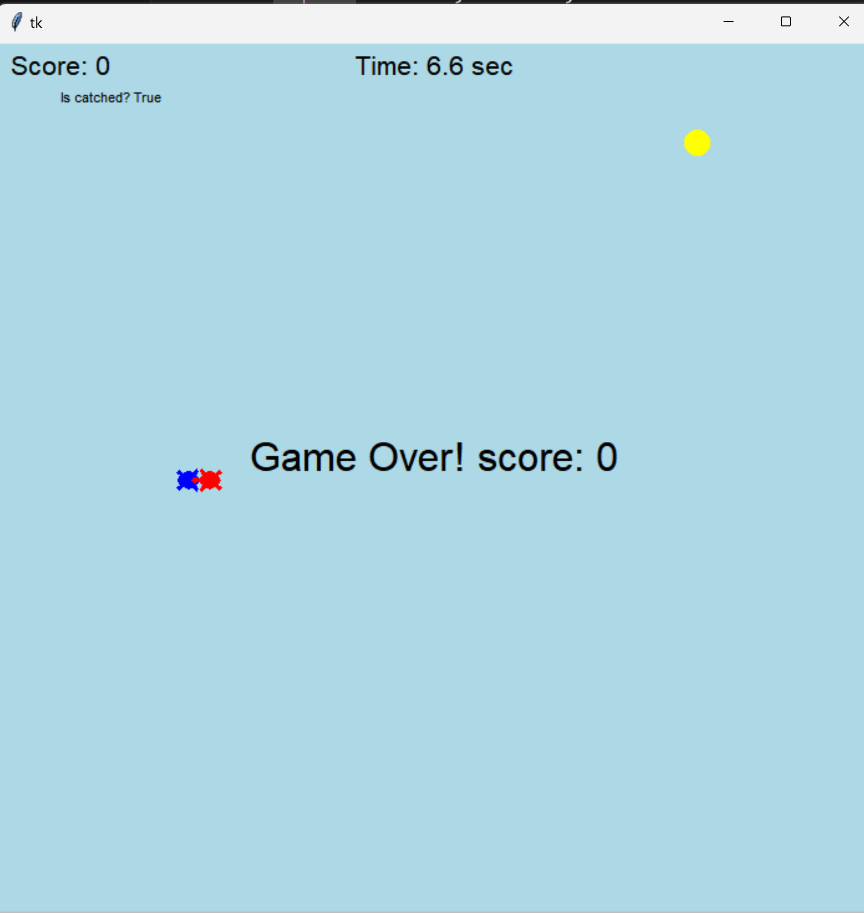

# 거북이 게임 설명

이 게임은 사용자가 거북이를 조작하여 노란색 동그라미를 먹으면서 도망가는 게임입니다. 반면에 컴퓨터는 사용자의 거북이를 쫓아가서 잡으려고 합니다. 

## 게임 구성 요소:
- **사용자 거북이 (파란색)**: 플레이어가 방향키를 사용하여 조작합니다.
- **컴퓨터 거북이 (빨간색)**: 자동으로 사용자의 거북이를 추적합니다.
- **노란색 동그라미**: 사용자 거북이가 이 동그라미를 먹으면 점수를 얻습니다.

## 게임 목적:
- 사용자 거북이가 최대한 오래 도망가면서 노란색 동그라미를 먹고 점수를 높이는 것입니다.
- 컴퓨터 거북이에게 잡히면 게임이 끝납니다.

## 게임 화면

## 게임 종료 조건:
- 사용자의 거북이가 컴퓨터 거북이에게 잡히면 게임이 종료되며 최종 점수가 표시됩니다.
